# Kimlik doğrulama (верификация SIM-карты)

← [К оглавлению](../README.md)

Верификация личности для SIM-карт иностранцев (БТК). Без неё номер могут заблокировать.

Для всех операторов процесс примерно одинаков и состоит из этапов:

1. Установка приложения Göçbil и заполнение профиля.
2. Создание заявки со стороны оператора.
3. Собственно верификация личности (самому в приложении или в офисе — зависит от оператора).
4. *(опционально)* Проверка заявки в e-Devlet.

### Оглавление

- [Установка Göçbil](#установка-göçbil)
- [1) Turkcell](#1-turkcell)
- [Подтверждение заявки в Göçbil](#подтверждение-заявки-в-göçbil)
- [2) Türk Telekom (ТТ)](#2-türk-telekom-тт)
- [3) Vodafone](#3-vodafone)
- [Проверка статуса в e-Devlet](#проверка-статуса-в-e-devlet)

Скриншоты и часть сценария Turkcell основаны на постах [Стамбульского канала](https://t.me/istanbul_channel): [1714](https://t.me/istanbul_channel/1714), [1715](https://t.me/istanbul_channel/1715).

---

## Установка Göçbil

Общий шаг для всех операторов.

Скачать:

- [App Store](https://apps.apple.com/tr/app/g%C3%B6%C3%A7bil/id6444447699)
- [Google Play (турецкий)](https://play.google.com/store/apps/details?id=tr.gov.goc.mobil)
- Android не турецкого региона: [APK](https://apkpure.com/g%C3%B6%C3%A7bil/tr.gov.goc.mobil)

Приложение есть только в турецких маркетах. Если маркет другой страны — нужен турецкий аккаунт (можно переключаться).

Зарегистрироваться и потом входить можно двумя способами: через e-Devlet или логин и пароль. Если войти через e-Devlet, данные в приложении будут уже заполнены.

Приложение глючит — просто повторите шаги. На iPhone часто не работает: проще взять Android. Если не нажимаются кнопки — уменьшите масштаб экрана в настройках.

Если проблему решить не удалось, можно сходить в офис оператора. В частности в Vodafone сотрудники могут попросить залогиниться на их устройстве, на котором приложение уже работает.

---

## 1) Turkcell

Сроки из практики канала: сделать **до ~5 сентября**; после блокировки восстановление возможно примерно **до 25 декабря**, потом номер могут забрать.

Если симка на другого иностранца — верифицируете его данными или переоформляете в офисе.

1. Обновите приложение Turkcell. Если интерфейс на английском — переключите на турецкий.
2. Установите Göçbil ([см. выше](#установка-göçbil)).
3. На старте может вылезти окно `Abonelik Kaydını Güncelle`. Если нет — [dijital.li/abonelikguncelleme](https://dijital.li/abonelikguncelleme) (язык приложения до перехода — турецкий).
4. Пройдите шаги: кимлик / дата рождения → тип документа (ВНЖ, рабочее, паспорт…) → сканирование документа с двух сторон → переход в Göçbil.

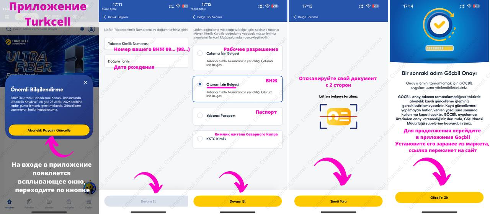

5. В Göçbil подтвердите заявку, [как в следующем разделе](#подтверждение-заявки-в-göçbil).
6. Статус проверьте в [e-Devlet](#проверка-статуса-в-e-devlet).

Несколько номеров: в Turkcell справа сверху человечек → `Hesap ekle`, затем заявку на каждый номер отдельно.

Принимают и ВНЖ, и рабочее; пишут, что бывает и просроченный ВНЖ. Вариант с паспортом в интерфейсе есть, но опыт менее очевидный.

---

## Подтверждение заявки в Göçbil

Этот сценарий — для **Turkcell** и **Türk Telekom**: после создания заявки у оператора вы сами подтверждаете её в Göçbil (включая распознавание лица).

У **Vodafone** подтверждение обычно проходит **в офисе силами оператора** (на вашем телефоне или на устройстве сотрудников) — отдельный раздел ниже.

1. `OPERATÖR İŞLEMLERİ`

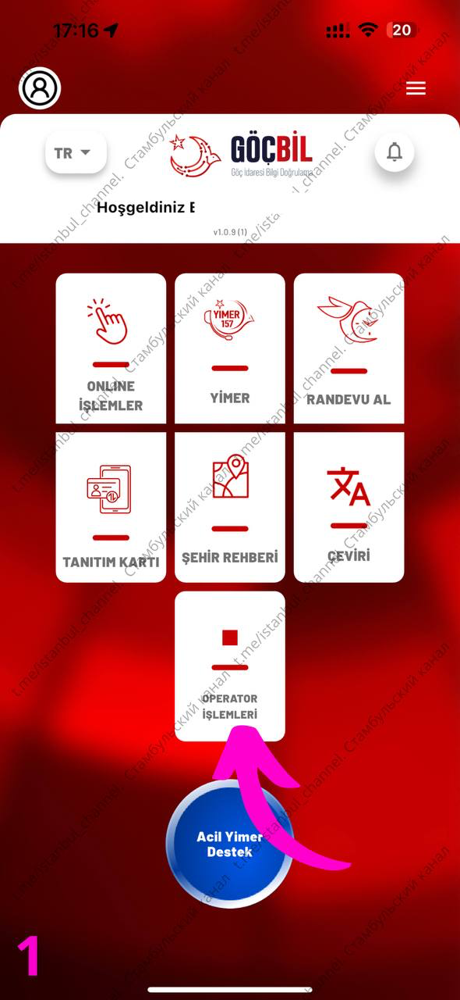

2. Тип `Haberleşme` → ваш оператор (`Turkcell` / для Türk Telekom — `ТТ`) → `Devam Et`

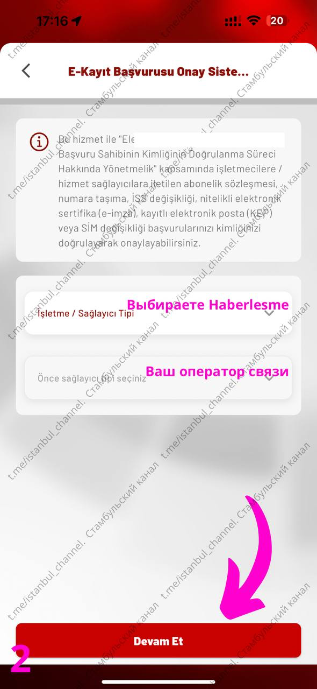

3. Заявка `Onay Bekliyor` → `Onayla`

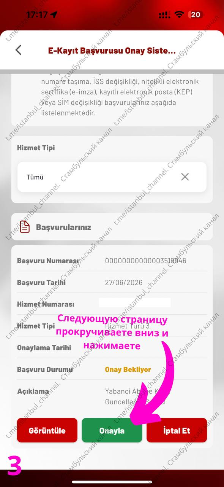

4. Вниз, галка → снова `Onayla`

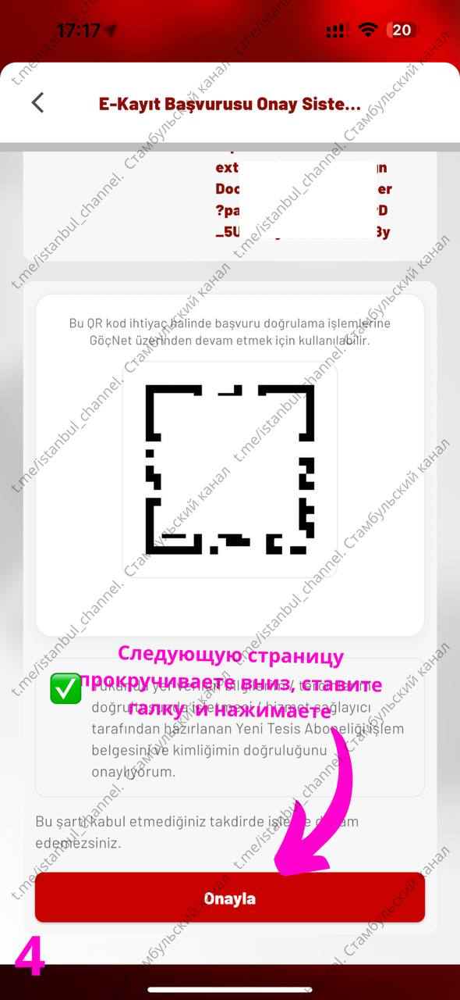

5. Документы иностранцев без чипа: `Yüz Tanıma ile Devam Et`

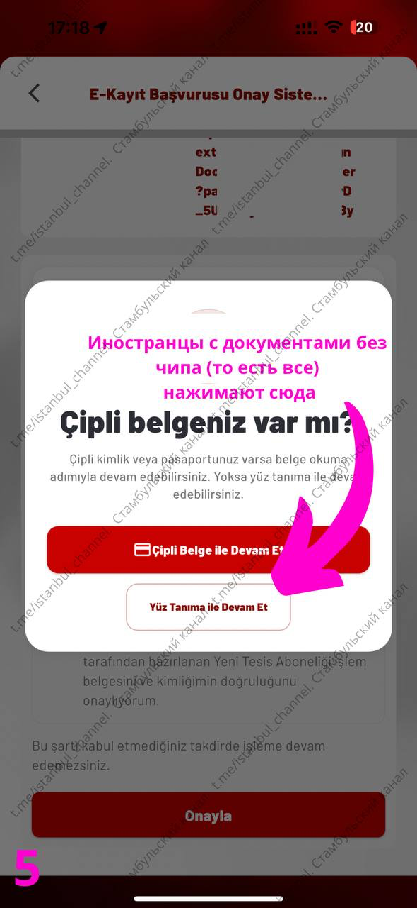

6. Разрешение камеры → `İzin Ver`

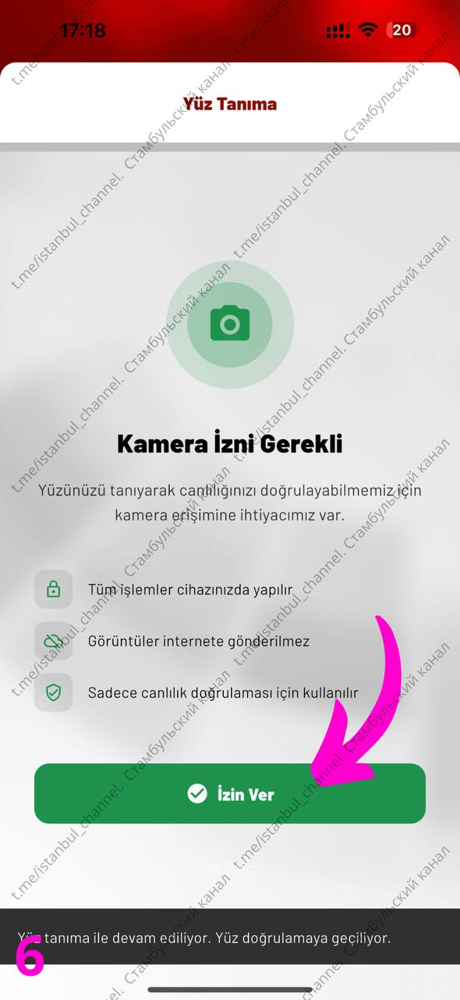

7. Без очков, маски, шапки/капюшона, достаточно светло → `Hazırım, Başlayalım`

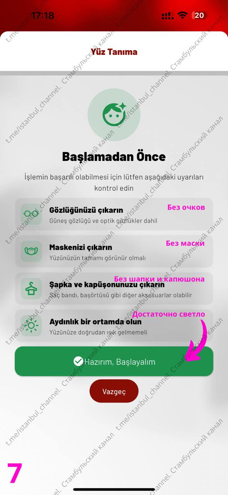

8. Следуйте подсказкам (повороты головы и т.п.). Между шагами бывает `Yüzünüzü düz tutun` — смотрите прямо.

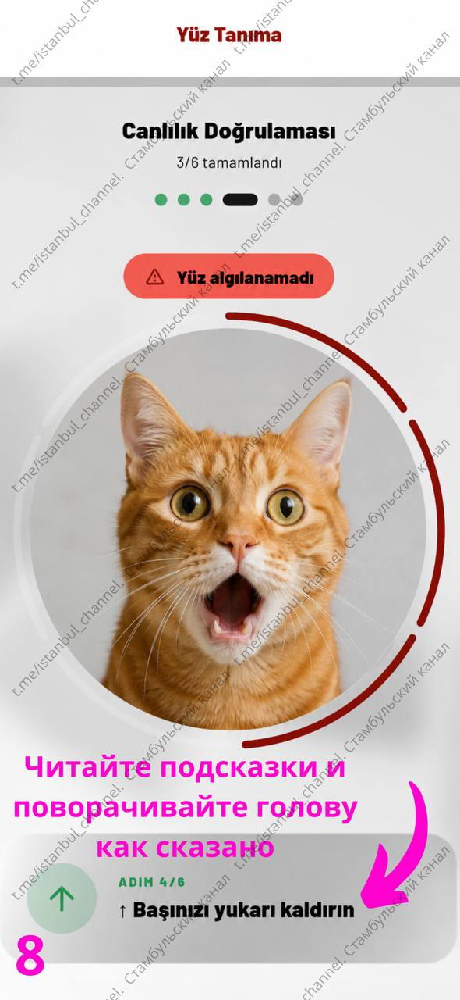

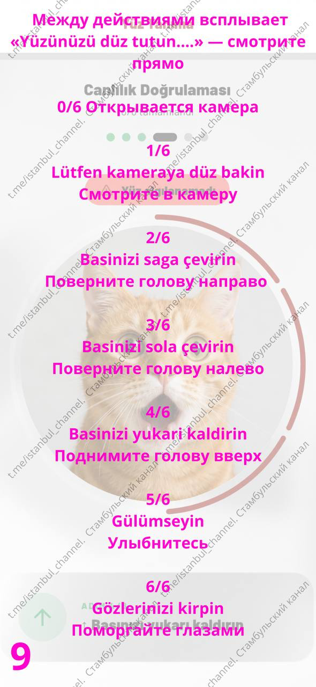

9. `Doğrulama Başarılı` → `Devam Et`

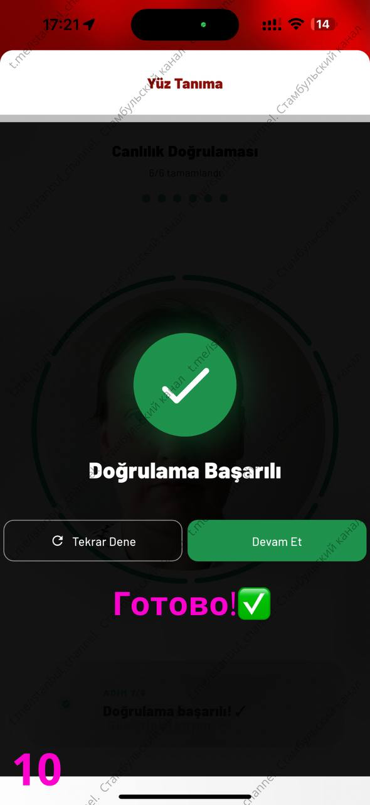

После этого статус в Göçbil должен стать `Onaylandı`. Затем проверьте [e-Devlet](#проверка-статуса-в-e-devlet).

---

## 2) Türk Telekom (ТТ)

В приложении Türk Telekom всё прямолинейно: тыкаешь по шагам, получаешь коды, приложение само говорит, что `başvuru` в Göçbil создан — иди туда.

Если приложения ТТ нет или лень искать — прямая ссылка для старта верификации:  
[https://onlineislem.turktelekom.com.tr/omni/kimlik-dogrulama](https://onlineislem.turktelekom.com.tr/omni/kimlik-dogrulama)

Дальше в Göçbil: [подтверждение заявки](#подтверждение-заявки-в-göçbil) — оператор **Türk Telekom / ТТ** → `Onayla` → распознавание лица → `Onaylandı`.

Статус в e-Devlet может появиться не сразу — см. [проверку статуса в e-Devlet](#проверка-статуса-в-e-devlet).

---

## 3) Vodafone

Göçbil нужно установить заранее ([установка](#установка-göçbil)). Саму заявку в приложении, как у Turkcell/ТТ, обычно **не создать** — нужен **офис Vodafone**.

В Анталье:

- рекомендуется офис у **Turkay Hotel**;
- **не рекомендуется** офис у **5M Migros**.

В офисе подтверждение заявки делают **сотрудники оператора**: открываете Göçbil со своего телефона или с их устройства, дальше они помогают пройти шаги. Самостоятельный сценарий из раздела [подтверждение заявки в Göçbil](#подтверждение-заявки-в-göçbil) здесь, как правило, не нужен.

После — проверьте статус в [e-Devlet](#проверка-статуса-в-e-devlet).

---

## Проверка статуса в e-Devlet

Статус заявки: [BTK e-Kayıt Başvurusu Onay İşlemleri](https://www.turkiye.gov.tr/btk-e-kayit-basvurusu-onay-islemleri-gercek-kisi).

В колонке `Başvuru Durumu` должно быть `Onaylandı`:

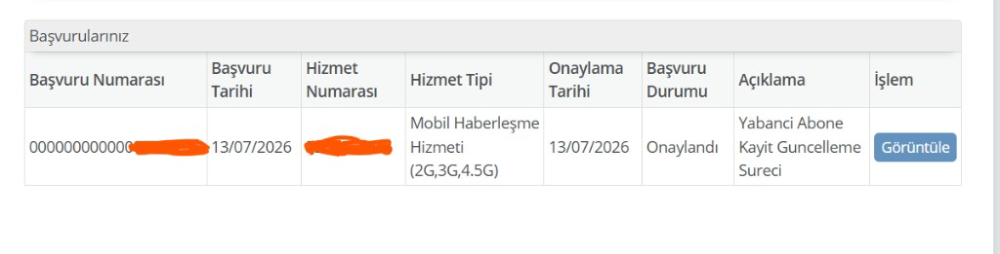
