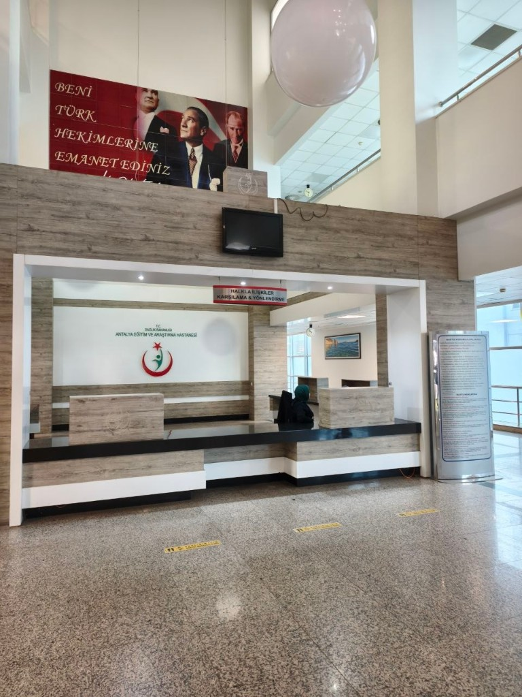
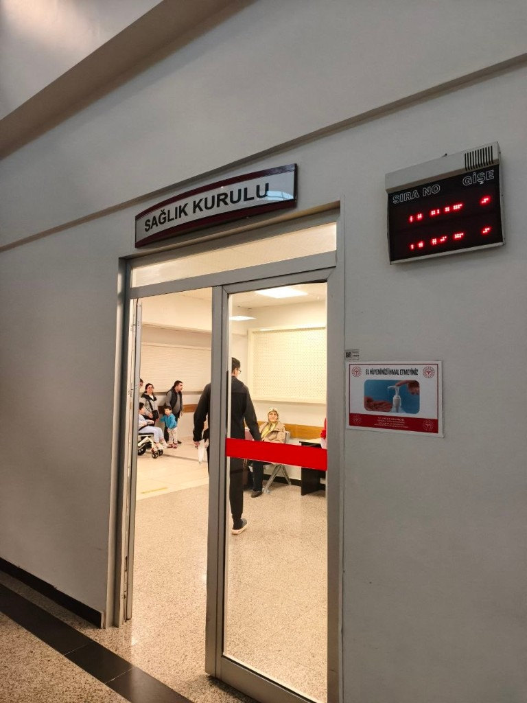

# Medical Board in Antalya for SGK: Step-by-Step

← [Table of contents](../README.md) · Русский: [README](README.md)

## Key Point

For SGK purposes in Antalya, medical board reports are accepted only from `Antalya Eğitim ve Araştırma Hastanesi`. Other hospitals may be closer or have easier appointment availability, but the SGK office does not accept them.

---

## 1) Booking a medical board appointment

### Option A: MHRS app

- Required appointment type: `Sağlık Kurulu Erişkin`.
- Slots are usually released around **17-19 days** before the appointment date, typically at **09:57-09:59**.
- You need to open the app at the exact time and book immediately.
- There is an `appointment request` (`randevu taleplerim`) feature:
  - if no slots are available, you get a `talep` button;
  - this creates a long-term appointment request;
  - you receive notifications when slots appear;
  - you still need to book manually.

### Option B: phone 182

Semi-automated flow (partly with an operator), Turkish language required:

1. Enter your kimlik number.
   - It is better to memorize the number in advance: there is very little time to enter it.
   - If you do not enter at least part of it in time, the flow restarts.
   - After 3 failed attempts, the call ends.
2. Press `1` (doctor appointment).
3. Say `Antalya`, then `evet`.
4. Say `Antalya Eğitim ve Araştırma hastanesi`, then `evet`.
5. Say `sağlık kurulu erişkin`, then `evet`.
6. You are transferred to an operator:
   - they ask for your first and last name;
   - confirm the details above;
   - offer an appointment time.

By phone, slots are available only up to around **15 days** ahead.

### Option C: without a pre-booked appointment

Some people managed to start the process without a pre-booked appointment:

- they went directly to reception;
- explained that they had an issue with booking;
- and managed to convince staff to start the medical board process anyway.

This is not a guaranteed scenario; it is only a practical workaround that sometimes works.

---

## 2) Day of the first hospital visit

On the appointment day, arrive by **09:00**, regardless of the time shown in your booking.

If you have chronic conditions (epilepsy, cancer, autoimmune diseases), bring documents translated into Turkish.

- It is preferable to come **fasting**, so you can do **blood** and **urine** tests if required. The test set is **individual**: the number of blood tubes may differ, and a urine test may or may not be requested.

`Polikliniği giriş` (entrance near the tram stop):  
[https://maps.app.goo.gl/ene2CfBKZGeadfMf9](https://maps.app.goo.gl/ene2CfBKZGeadfMf9)

### Steps in the hospital

1. Go straight to reception and get the application form (screenshot 1).
   - Bring photocopies of `WP` or `ikamet` (yours and the person whose insurance your SGK is linked to).

2. With the completed form, go slightly back to the `sağlık kurulu` corner (screenshot 2):
   - take a queue number from the machine and wait;
   - submit the form and receive a payment paper;
   - go one floor up to the cashier and pay;
   - return to `sağlık kurulu`, do not wait in queue again, approach directly;
   - get the circulation sheet (list of doctor rooms).

You have **30 days** to complete all doctors.

---

## 3) Visiting doctors

- Visit all doctors listed on your circulation sheet.
- It is recommended to start with infectious disease and internal medicine:
  - they assign additional tests;
  - they control test results;
  - their stamps are usually added only on a follow-up visit with test results.
- Blood is taken by queue numbers; the line usually moves quickly.
- The number of blood tubes may vary.

It is possible to finish in one day, but test results are usually ready only after lunch, so waiting is likely (including lunch break time).

---

## 4) Return to sağlık kurulu and receive your board date

After all doctors are completed, go again to `sağlık kurulu`:

- either take a queue number;
- or ask at the first desk.

There they assign your board date (`sağlık kurulu`). The room is in the same nearby section.

---

## 5) Board day

It is better to arrive **before 09:00** so there are fewer people.

1. Hand all papers to the security person in the board room.
2. Wait until your surname is called.
3. The board writes the conclusion.
4. Sometimes the board requests extra opinions from doctors (you need to go out and get them).

After the board is completed, the report should appear in `e-Devlet` in about **10 days**: [e-İmzalı Durum Bildirir Sağlık Kurulu Raporları Sorgulama](https://www.turkiye.gov.tr/saglik-e-imzali-durum-bildirir-saglik-kurulu-raporlari-sorgulama).

---

## 6) After report appears: SGK office

When the report appears in `e-Devlet`, go to the SGK office:  
[https://maps.app.goo.gl/ghJNT57kbSjFo4qg8](https://maps.app.goo.gl/ghJNT57kbSjFo4qg8)

- Service is by queue number.
- There is an English-speaking employee.
- Write an application to link your report to SGK.

Additionally, you can ask them to send your document package by email:

- for this, you need to write your `e-Nabız` password;
- and disable two-factor authentication.

---

## 7) If a hospital still asks you to pay

Even in public hospitals, including `Antalya Eğitim ve Araştırma Hastanesi`, they may still incorrectly ask for payment, although after proper SGK report registration this should not happen.

A practical scenario that helped solve this issue:

1. If they give you a payment slip, you can first check the amount at cashier (`vezne`).
2. Then go down to reception and explain the situation, for example:

   > "I came to my booked doctor appointment, but I was told I need to pay before the visit. I want to understand why I need to pay, because I passed the medical board (`Sağlık kurulu`) and registered it at the SGK office."

3. Give reception your payment slip and `kimlik` (if needed, you can also show your report from `e-Nabız`).
4. Usually, after checking, reception contacts accounting (`Fatura`) and sends you to a relevant specialist (in this case, it was an office on the 3rd floor).
5. At that office, provide the payment slip and `kimlik` again: they check your record in the system and may update data (in this case, after that no more payments were requested, including later visits in the same hospital).

This is not guaranteed in 100% of cases, but in practice it can help when the system has not yet pulled your status correctly after `Sağlık Kurulu` and SGK registration.
